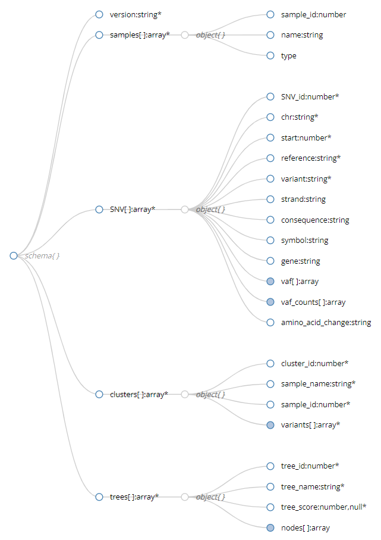

# Aggregate_json Task

This is a WDL task to take workflow outputs and VEP annotations and combine the results in a json format compatible with the PhyloDiver visualization interface ([PhyloDiver.orgl](https://www.phylodiver.org/), [Github](https://github.com/ncsa/phylodiver-viz/tree/develop/src))

## Inputs and Execution

This WDL Task has a example execution script, `run_aggregate_json.sh`, in the main directory which runs the task in isolation against the data files in the `example_data/` directory. This script relies on miniwdl and docker to be correctly installed.

This task requires four inputs to run. They are:

1. `VEP_FILE`: the VEP output annotation of a somatic VCP variant file.
   - e.g. `example_data/mek_lab_vcfs/VEP_raw.A25.mutect2.filtered.snp.vcf`
2. `CLUSTER_ASSIGNMENT`: the PyClone-VI assignment of sample variants to specific mutation clusters.
   - e.g. `example_data/cluster/pyclone_vi_cluster_assignment.tsv`
3. `SPRUCE_JSON`: SPRUCE description of the structure of the inferred trees.
   - e.g. `example_data/spruce/spruce.res.json`
4. `SPRUCE_RES`: SPRUCE description of the different tree inference solutions with subclone proportions.
   - e.g. `example_data/spruce/spruce.res.gz`

This script will produce a file `aggregated.json` which contains the merged inputs in a formatted JSON as defined below.

## JSON Output Format

The output of this task is a JSON file that follows the schema required for visualization of the results with PhyloDiver. THe definition of this schema is found in the [here](code/aggregate.schema) in the code directory.

Briefly, the schema includes data organized by:

1. `version`: The schema version used for the JSON construction
2. `samples`: An array of information for the sequenced samples, including the normal tissue sample
3. `SNV`: Genomic and annotation information extracted from the VCF files about each variant mutations
4. `clusters`: Mapping information of variants to mutation clusters for defining phylogeny edges
5. `trees`: An array of inferred phylogenetic trees that relate the mutation clusters into evolutionary histories
